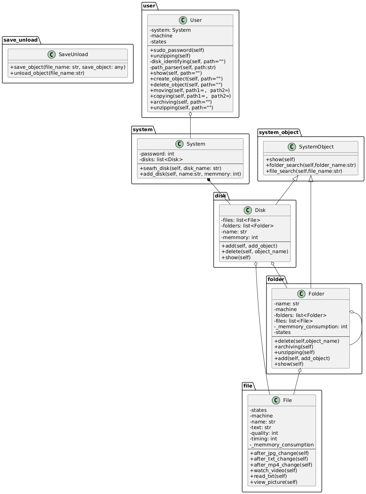
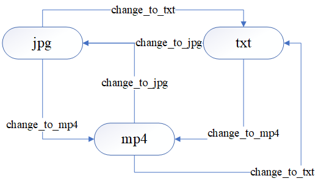
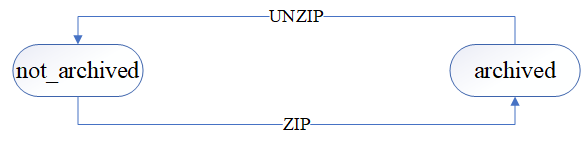

# Модель файловой системы

## 1. Диаграмма классов

## 2. Основной класс

### User
**Описание**: Класс, представляющий пользователя. Отвечает за взаимодействие пользователя и системы.
- **Поля**:
  - `system` – система, с которой взаимодействует пользователь.
  - `machine` – сущность, которая управляет состояниями, переходами и моделью. Моделью в данном случае является User.
  - `states` – состояния. Их два: admin и user.
- **Методы**:
  - `sudo_password(self)` – вызывается при смене состояния пользователя с user на admin. Проверяет, чтоюы пользователь знал пароль для перехода в состояние admin
  - `unzipping(self)` – разархивирует выбранную папку.
  - `disk_identifying(self, path="")` – определяет диск, в котором происходит действие. 
  - `path_parser(self, path)` – определяет место, где происходит действие.
  - `show(self, path="")` – просмотр объекта. 
  - `create_object(self, path="")` – создание объекта. Это создание изменяет и параметры системы: память.
  - `archiving(self, path="")` – архивирует выбранную папку.
  - `delete_object(self, path="")` – удаление объекта. Это удаление изменяет и параметры системы: память.
  - `moving(self, path1="", path2="")` – перемещение объекта. Это перемещение изменяет и параметры системы: память.
  - `copying(self, path1="", path2="")` – копирование объекта. Это копирование изменяет и параметры системы: память.
  **Диаграмма состояний**:
  

## 3. Остальные классы

### File
**Описание**: Класс, отвечающий за опперации с файлами.
- **Поля**:
  - `_memmory_consumption` – сколько памяти потреблянт файл.
  - `machine` – сущность, которая управляет состояниями, переходами и моделью. Моделью в данном случае является File.
  - `states` – состояния. Их три: txt, jpg, mp4.
  - `timing` – хронометраж для mp4 файлов.
  - `quality` – качество изображения для jpg файлов.
  - `text` – текст текстового файла для txt файлов.
  - `name` – имя файла.
- **Методы**:
  - `after_jpg_change(self)` – вызывается при переходе файла в формат jpg. Работает с полями
  - `after_txt_change(self)` – вызывается при переходе файла в формат txt. Работает с полями
  - `after_mp4_change(self)` – вызывается при переходе файла в формат mp4. Работает с полями
  - `watch_video(self)` – открывает файл как mp4.
  - `read_txt(self)` – открывает файл как txt.
  - `view_picture(self)` – открывает файл как jpg.
  **Диаграмма состояний**:
  

### SystemObject
**Описание**: Класc для создания классов Folder и Disk.
- **Методы**:
  - `show(self)` – отображает содержимое объекта.
  - `folder_search(self, folder_name)` – ищет папку по имени.
  - `file_search(self, file_name)` – ищет файл по имени.

### Folder
**Описание**: Класс, отвечающий за опперации с папками. Наследует класс SystemObject
- **Поля**:
  - `_memmory_consumption` – сколько памяти потреблянт папка.
  - `machine` – сущность, которая управляет состояниями, переходами и моделью. Моделью в данном случае является Folder.
  - `states` – состояния. Их два: not_archived, archived.
  - `files` – список хранящихся в Folder файлов.
  - `folders` – список хранящихся в Folder папок.
  - `name` – имя папки.
- **Методы**:
  - `delete(self, object_name)` – удаление объекта в папке.
  - `archiving(self)` – архивирование папки. Вызывается при переходе в состояние archived.
  - `unzipping(self)` – разархивирование папки. Вызывается при переходе в состояние not_archived.
  - `add(self, add_object)` – добавление объекта в папку.
  - `show(self)` – отобразить содержимое папки.
  **Диаграмма состояний**:
  

### Disk
**Описание**: Класс, отвечающий за опперации с дисками. Наследует класс SystemObject
- **Поля**:
  - `memmory` – сколько памяти в диске.
  - `name` – имя диска.
  - `files` – список хранящихся в Disk файлов.
  - `folders` – список хранящихся в Disk папок.
- **Методы**:
  - `delete(self, object_name)` – удаление объекта в диске.
  - `add(self, add_object)` – добавление объекта в диск.
  - `show(self)` – отобразить содержимое диска.

### System
**Описание**: Класс, являющийся моделью системы
- **Поля**:
  - `password` – пороль для получения прав админа в системе.
  - `disks` – список хранящихся в System дисков.
- **Методы**:
  - `search_disk(self, disk_name)` – поиск диска в системе по имени.
  - `add_disk(self, name)` – добавление диска в систему.

### SaveUnload
**Описание**: Класс, нужный для сохранения и загрузки данных
- **Методы**:
  - `save_object(file_name, save_object)` – сохранение данных в файл с именем file_name.
  - `unload_object(file_name)` – загрузка данных.